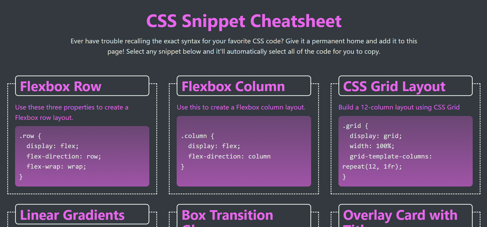

## CSS-Snippet-Cheat



## Description
a webpage that hold a collection of CSS snippets. What better way to learn CSS than to build a knowledge base of CSS?


## Installation

1. Clone this repository to your local machine using:
   ```bash
   git clone  git@github.com:tegaomare/CSS-Snippet-Cheat--Sheet.git
Navigate to the project directory:

bash

Copy code

cd horiseon-social-services

Open the index.html file in your preferred web browser.

## Credits
Columbia University Coding Bootcamp

## License 
MIT license

## Page link
https://tegaomare.github.io/CSS-Snippet-Cheat--Sheet/